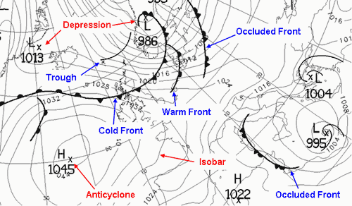

# Procesarea hartilor  

## Obiective
Identificarea fronturilor atmosferice in imagini de tip "synoptic map"

## Ideea de baza
Identificarea in imagini a fronturilor atmosferice ;i corelarea lor cu incidentele de tip AVC. 
S-a constatat ca de-a lungul timpului distributia pe zile a accidentelor vasculare se poate corela cu anumit factori meteo precum frontul atmosferic, presiunea, temepratura, etc.
Primul pas ar fi identificarea acestor fronturi ]n imaginile de tip "synoptic map". 

## TODOlist
1. Colectarea de imagini de tip "synoptic map".
2. identificarea fronturilor ]n imagini
3. clasificarea fronturilor (reci, calde, mixte).

## Date si referinte
**Date si biblioteci**
- https://www.wetter3.de/archiv_dwd_dt.html
- https://danepubliczne.imgw.pl/datastore

**Metode de lucru**
- https://www.rmets.org/metmatters/how-interpret-weather-chart
- https://www.weather.gov/jetstream/wxmaps
- https://wcd.copernicus.org/articles/3/113/2022/wcd-3-113-2022.pdf