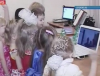

# Detectia emotiilor in comportamentul prescolarilor  	 

## Obiective
Identificarea emotiilor pe care le traiesc prescolarii in timp ce folosesc aplicatii educative 

## Ideea de baza
Succesul sau esecul unei aplicatii interactive este determinata de utilizabilitatea produsului. Una din componentele utilizabilitatii este satisfactia utilizatorului. Evaluarea satisfactiei pentru utilizatorii adulti se realizeaza prin observatie, interviuri post-interactiune sau metode cantitative (chestionare) care insa nu pot fi aplicate copiilor prescolari, care au capacitate limitata de autoanaliza si  de comunicare, nu pot citi si nu pot scrie.  Astfel, pe langa observatie (care poate fi subiectiva, depinzand de modul de interpretare a reactiilor prescolarului de catre expertul care realizeaza aplicatia), se doreste o masurare obiectiva a emotiilor pe care le traiesc copiii in timpul interactiunii. Pentru aceasta este nevoie de dezvoltarea unei aplicatii care sa permita identificarea starilor emotionale ale unui prescolar in timpul derularii unei activitati (de ex. 30% din timp a zambit sau asocieri intre sarcini pe care le fac copiii si frecventa unei emotii).

## TO DO list
Inregistrare activitate (prescolar interactioneaza cu calculatorul in timpul activitatii, deci poate fi „urmarit” folosind camera si microfonul  calculatorului) si etichetarea acesteia cu una sau mai multe stari emotionale
- Folosirea unui model de recunoastere a emotiilor in imagini/video ale fetei
- Antrenarea si validarea unui model de recunoastere a emotiilor in voce / semnale audio (pe o baza de date de tip benchmark)
    - Iteratia1
        - analiza datelor
        - extragerea de caracteristici acustice din semnalele audio (by a tool - e.g. [Librosa](https://librosa.org/doc/latest/index.html) - or by implementing the feature extractor) 
        - clasificarea semnalelor audio pe categorii de emotii folosind un model de clasificare (bazat pe SVM, ANN, etc.)
        - evaluarea procesului de recunoastere a emotilor
    - Iteratia2
        - extragerea de caracteristici spectrale din semnalele audio (format2D)
        - clasificarea semnalelor audio pe categorii de emotii folosind un model de clasificare bazat pe CNN
        - evaluarea procesului de recunoastere a emotilor
        - compararea aboradrii din iteratia 1 cu abordarea din iteratia 2
- Inregistrarea si stocarea activitatii unui prescolar
- Folosirea modelelor de recunoastere a emotiilor pentru etichetarea activitatii inregistrate pentru un anumit prescolar si pentru un grup de prescolari

Imbunatatire componente inteligente
- Din perspectiva calitatii procesului de invatare automata
- Din perspectiva complexitatii temporale si spatiale aferenta clasificatorului
- Din perspectiva clientului (utilizarii aplicatiei de catre prescolar in colaborare cu educatoarea/psihologul)

## Date si referinte

1. Emotii faciale 

**Date**
- Cohn-Kanade http://www.consortium.ri.cmu.edu/ckagree/
- FER https://www.kaggle.com/c/challenges-in-representation-learning-facial-expression-recognition-challenge/overview
- CAFE (for kids) link](http://databrary.org/volume/30) https://www.childstudycenter-rutgers.com/the-child-affective-facial-expression-se
- EmoReact (for kids)  [link spre date](http://www.cs.ubbcluj.ro/~lauras/test/docs/school/MIRPR/2019-2020/emoReact.zip) detalii despre date: Nojavanasghari, Behnaz, et al. "EmoReact: a multimodal approach and dataset for recognizing emotional responses in children." Proceedings of the 18th acm international conference on multimodal interaction. ACM, 2016 [link](https://www.behnaznojavan.com/data)
- UBB database [link spre date](http://www.cs.ubbcluj.ro/~lauras/test/docs/school/MIRPR/2019-2020/ubbKids.zip) [date noi](https://photos.app.goo.gl/sSPzhoBQF9n3Nm7cA)

**Algoritmi**
- FER https://github.com/justinshenk/fer
- https://heartbeat.comet.ml/detect-facial-emotions-on-mobile-and-iot-devices-using-tensorflow-lite-e98e7a48c309
- Recunoasterea fetei si emotii faciale http://www.consortium.ri.cmu.edu/index.php#projects

**Lucrari**
- Mellouk, W., & Handouzi, W. (2020). Facial emotion recognition using deep learning: review and insights. Procedia Computer Science, 175, 689-694.
- Riyantoko, P. A., & Hindrayani, K. M. (2021, March). Facial Emotion Detection Using Haar-Cascade Classifier and Convolutional Neural Networks. In Journal of Physics: Conference Series (Vol. 1844, No. 1, p. 012004). IOP Publishing.
- Khaireddin, Y., & Chen, Z. (2021). Facial Emotion Recognition: State of the Art Performance on FER2013. arXiv preprint arXiv:2105.03588.

2. Emotii in vorbire
**Data**
- https://zenodo.org/record/1188976#.XYnKuigzY2x
- emotions [RAVDESS](https://zenodo.org/record/1188976#.YjjY5epBy5e)
- polarity [CMU-Moisei](http://multicomp.cs.cmu.edu/resources/cmu-mosei-dataset/)

**Metode de lucru**
1. Tarnowski, Paweł, et al. ”Emotion recognition using facial expressions.” Procedia Computer Science 108 (2017): 1175-1184.
2. Singh, Shilpi, and S. V. A. V. Prasad. "Techniques and Challenges of Face Recognition: A Critical Review." Procedia computer science 143 (2018): 536-543.
3. Samadiani, Najmeh, et al. "A review on automatic facial expression recognition systems assisted by multimodal sensor data." Sensors 19.8 (2019): 1863.
4. Singh, Shilpi, and S. V. A. V. Prasad. "Techniques and Challenges of Face Recognition: A Critical Review." Procedia computer science 143 (2018): 536-543.
5. Lu, Chaochao, and Xiaoou Tang. "Surpassing human-level face verification performance on LFW with GaussianFace." Twenty-ninth AAAI conference on artificial intelligence. 2015.
6. Taigman, Yaniv, et al. "Deepface: Closing the gap to human-level performance in face verification." Proceedings of the IEEE conference on computer vision and pattern recognition. 2014.
7. Schroff, Florian, Dmitry Kalenichenko, and James Philbin. "Facenet: A unified embedding for face recognition and clustering." Proceedings of the IEEE conference on computer vision and pattern recognition. 2015.
https://www.faceplusplus.com/
8. El Ayadi, Moataz, Mohamed S. Kamel, and Fakhri Karray. "Survey on speech emotion recognition: Features, classification schemes, and databases." Pattern Recognition 44.3 (2011): 572-587.
9. Kerkeni, Leila, et al. "Automatic Speech Emotion Recognition Using Machine Learning." Social Media and Machine Learning. IntechOpen, 2019.
10. LoBue, Vanessa, and Cat Thrasher. "The Child Affective Facial Expression (CAFE) set: Validity and reliability from untrained adults." Frontiers in psychology 5 (2015): 1532.
11. Lassalle, Amandine, et al. "The EU-Emotion Voice Database." Behavior research methods 51.2 (2019): 493-506.
12. Matsuda, Yuki, et al. "Emotour: Estimating emotion and satisfaction of users based on behavioral cues and audiovisual data." Sensors 18.11 (2018): 3978.
13. Issa, D., Demirci, M. F., & Yazici, A. (2020). Speech emotion recognition with deep convolutional neural networks. Biomedical Signal Processing and Control, 59, 101894.
14. [Papers with code](https://paperswithcode.com/task/speech-emotion-recognition)
15.  Stolar, M., Lech, M., Bolia, R. S., & Skinner, M. (2018, December). Acoustic characteristics of emotional speech using spectrogram image classification. In 2018 12th International Conference on Signal Processing and Communication Systems (ICSPCS) (pp. 1-5). IEEE.
16. Verbitskiy, Sergey, Vladimir Berikov, and Viacheslav Vyshegorodtsev. ”Eranns: Efficient residual audio neural networks for audio pattern recognition.” arXiv preprint arXiv:2106.01621 (2021).
17. Lassalle, Amandine, et al. "The EU-Emotion Voice Database." Behavior research methods 51.2 (2019): 493-506.
18. Matsuda, Yuki, et al. "Emotour: Estimating emotion and satisfaction of users based on behavioral cues and audiovisual data." Sensors 18.11 (2018): 3978.
19. Issa, D., Demirci, M. F., & Yazici, A. (2020). Speech emotion recognition with deep convolutional neural networks. Biomedical Signal Processing and Control, 59, 101894.
