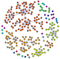

# Analiza retelelor complexe 	

## Obiective
Studiul proprietatilor si fenomenelor care apar in retelele complexe

## TO DO list
1. cum influenteaza tipul relatiilor dintre studenti definirea comunitatilor ce pot aparea in reteaua pe care o formeaza? (Exista mai mult tipuri de relatii in datasetul furnizat,  comunitatile create au o diveristate in tipurile de relatii? Sau “cine se aseamana se aduna”?)
	- dataset: http://networkrepository.com/soc-student-coop.php
	- lucrare: http://www.ise.bgu.ac.il/faculty/fire/pdf/fire2012predicting.pdf
	

2. cum tind sa formeze comunitati persoanele populare aka influencers pe tweeter (aici se poate discuta definitia popularitatii prin diferite metrici ca si degree centrality, betweeness centrality, articulation point)  - principiul "cine se aseamana se aduna") 
	- dataset: http://networkrepository.com/soc-twitter-follows.php
	- lucrare: https://arxiv.org/pdf/1211.4266.pdf

3. comportamentul social al furnicilor (retea dinamica) - sunt furnicile insecte sociale? isi schimba des comunitatile din care fac parte, sau tind sa ramana in aceleasi comunitati? Exista vreun pattern in comportamentul furnicilor in acest sens?
	- dataset: https://github.com/bansallab/asnr/tree/master/Networks/Insecta/ants_proximity_weighted
	- lucrare: https://www.nature.com/articles/s41597-019-0056-z
